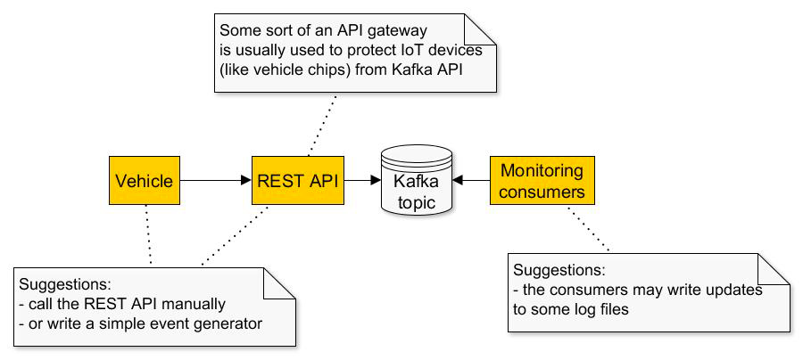

Prerequisites:

Configure a Kafka cluster using Docker with the following parameters: 
* Number of brokers - 3 
* Number of partitions - 3 
* Replication factor - 2 
* observe the Kafka broker logs to see how leaders/replicas for every partition are assigned

Tips
* if you’re working on a machine with 16 Gb of RAM or less, you might need to fall back to just 2 brokers
* an example of a Docker Compose for a 2-node cluster based on the official Confluent Kafka image, can be found here

Practical Task:
1. Implement a pair of "at least once" producer and "at most once" consumer.
2. Implement another pair of producer and consumer with exactly-once delivery (use the Transactional API)
3. Implement a taxi application using Spring Boot. The application should consist of three components:
   * REST service fo sending taxi coordinates and car ID.
   * Kafka broker. 
   * Three consumers to calculate the distance traveled by a car.

Important
* Messages from every vehicle must be processed sequentially!

Tips
* the first two subtasks may be done as integration tests (for example, using the Embedded Kafka from Spring Boot)